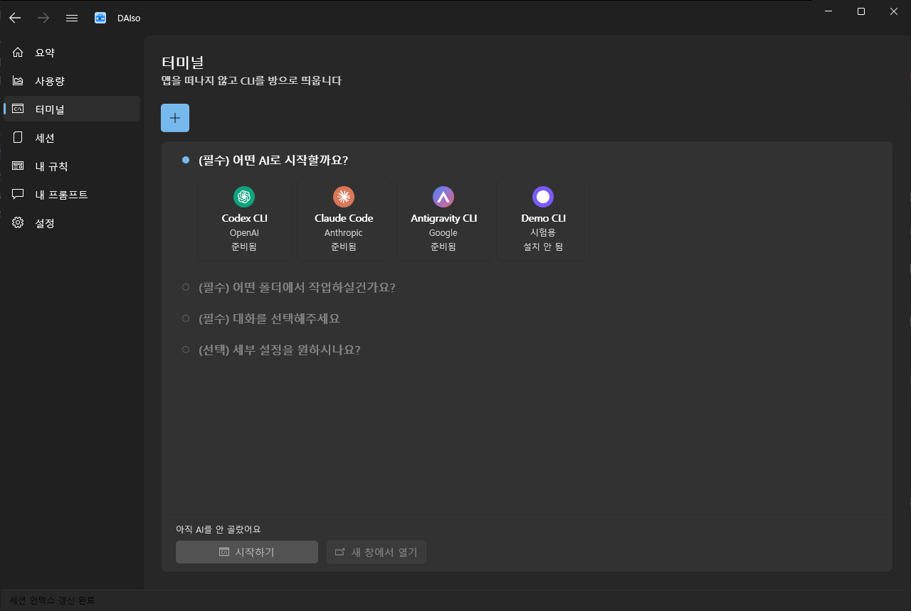
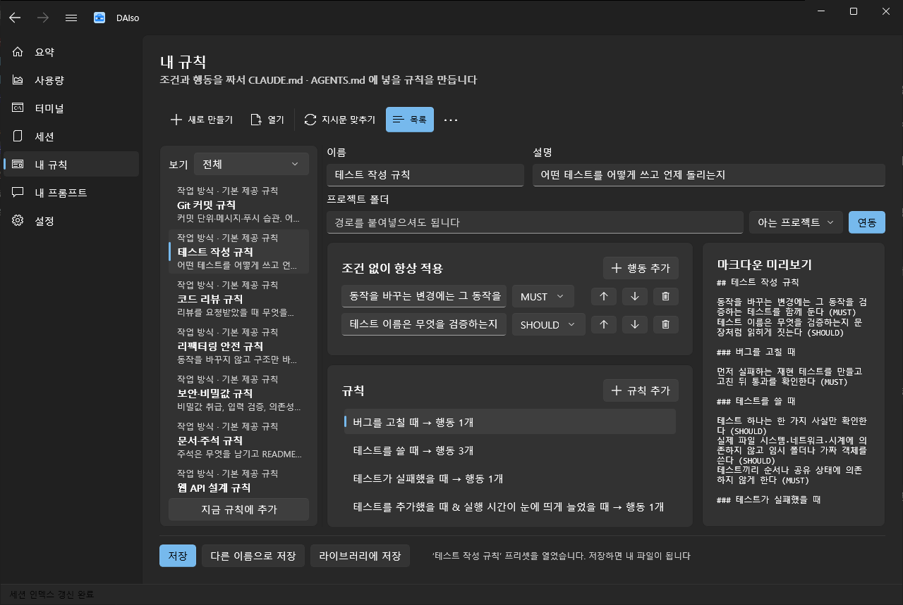
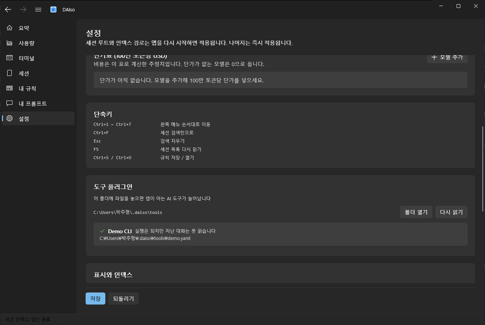

# d-AI-so

AI에 필요한게 다이소.

Claude Code, Codex CLI, Antigravity CLI를 Windows에서 한 창에 모아 씁니다.
로그인이 살아 있는지 확인하고, 지난 대화를 찾아 이어서 열고, 토큰을 얼마나 썼는지 봅니다.
CLI는 앱 안에서 바로 띄울 수 있습니다.

인터넷으로는 아무것도 보내지 않습니다. 도구들이 이 PC에 이미 만들어 둔 파일만 읽습니다.


## 기능

| 화면 | 하는 일 |
|---|---|
| 요약 | 도구별 계정·요금제·만료일, 최근 세션 |
| 터미널 | 앱 안에서 CLI 띄우기, 새 창으로 분리 |
| 세션 | 프로젝트별 대화 기록, 본문 검색, 이어서 열기, markdown 내보내기 |
| 사용량 | 토큰 추이, 단가표 기반 비용 추정 |
| 내 규칙 | `PROJECT_RULES.daiso` 편집, `CLAUDE.md`·`AGENTS.md` 연동 |
| 내 프롬프트 | 절차형 프롬프트 골라 프로젝트에 넣고 첫 메시지로 보내기 |
| 설정 | 경로·단가표·테마, [직접 추가한 도구](#도구-추가) 목록 |

| 터미널 | 세션 |
|---|---|
|  |  |

| 사용량 | 내 규칙 |
|---|---|
|  |  |

## 빌드와 실행

.NET SDK 8 이상이 필요합니다. 이 저장소는 SDK 10에서 `net8.0`을 타겟합니다(`global.json`).

```bash
dotnet build Daiso.sln
```

경고 0, 오류 0이 정상입니다(`TreatWarningsAsErrors=true`).
WinUI 앱은 x64로만 빌드되지만 솔루션이 `Any CPU`를 `x64`로 매핑해 두었으니 위 한 줄로 끝납니다.

실행은 이 스크립트로 하세요. 방금 빌드한 파일을 그대로 띄웁니다.

```bash
pwsh tools/run-app.ps1
```

산출물은 `src/Daiso.App/bin/Debug/net8.0-windows10.0.19041.0/win-x64/d-AI-so.exe`입니다.
설치가 필요 없고, .NET 런타임과 Windows App SDK를 산출물에 담았기 때문에(`SelfContained`, `WindowsAppSDKSelfContained`)
PC에 깔린 런타임과 상관없이 돕니다. 창은 1024×700까지만 작아집니다.

배포는 `tools/make-installer.ps1`로 설치 프로그램을 만듭니다. 무엇을 담고 무엇을 담지 않는지는
[docs/RELEASE.md](docs/RELEASE.md)가 정합니다. `dotnet publish`는 쓰지 마세요. unpackaged WinUI 앱에서는
컴파일된 XAML(`App.xbf`, `Views/`, `Ui/`)과 `d-AI-so.pri`를 빠뜨려서, 실행하면 시작하자마자 죽습니다(2026-09-11 확인).

판 번호는 `Directory.Build.props`의 `Version` 하나로 관리합니다. 설정 화면이 그 값을 그대로 보여줍니다.

## 도구 추가

앱이 아는 도구는 세 개로 고정된 게 아닙니다.
`%USERPROFILE%\.daiso\tools\`에 YAML 파일을 넣으면 그 도구가 탭과 카드에 함께 올라옵니다.
다시 빌드할 필요는 없고, 앱만 다시 켜면 됩니다.



### YAML 한 장으로 되는 것

이름과 색이 붙고, 터미널에서 그 도구를 띄울 수 있게 됩니다.

```yaml
# %USERPROFILE%\.daiso\tools\mycli.yaml
schema: 1
id: mycli                                  # 소문자, 숫자, - 로 2~32자. 글자로 시작
name: My CLI
short: My                                  # 탭에 쓸 짧은 이름
vendor: 우리팀
initial: M                                 # 로고 자리에 넣을 한 글자
color: "#7A5AF8"                           # 두 개 이상이면 그라데이션
executable: mycli.cmd                      # PATH 에서 찾음
install:
  uri: https://example.com/mycli           # 안 깔려 있을 때 안내할 주소
  # command: npm install -g mycli          # 설치 명령을 대신 쓸 수도 있음
sessionsRoot: "{USERPROFILE}/.mycli/sessions"
rules:
  fileName: MYCLI.md                       # 이 도구가 읽는 프로젝트 지시문 파일
context:
  - "{PROJECT}/MYCLI.md"                   # 컨텍스트 점검이 찾아볼 자리
resume: "--resume {id}"                    # 이어서 열 때 붙일 인자
```

`id`는 계정 보관함의 폴더 이름으로도 쓰이니 한번 정하면 바꾸지 않는 게 좋습니다.
경로에는 `{USERPROFILE}`, `{PROJECT}`, `{HERE}`(이 YAML이 있는 폴더)를 쓸 수 있습니다.

여기에 `order`(표시 순서), `logoPath`(SVG 경로 데이터), `appendOnly`, `imagePasteKeys`,
`auth.files`(로그인 파일 목록), `models.list`(모델 선택 목록)도 적을 수 있습니다.

YAML이 틀렸을 때 도구가 조용히 사라지지는 않습니다.
모르는 키를 썼거나 `id`가 비었거나 내장 도구와 겹치거나 두 파일이 같은 `id`를 쓰면
설정 화면이 파일 이름과 이유를 같이 보여줍니다. 한 파일이 깨져도 나머지는 그대로 실립니다.

### 대화 기록까지 읽으려면

세션 목록, 검색, 사용량까지 쓰려면 기록을 읽어줄 프로그램을 하나 붙이면 됩니다.

```yaml
adapter:
  command: "node {HERE}/mycli-adapter.js"
```

stdin으로 요청 한 줄을 받아서 stdout으로 답을 여러 줄 쓰는 프로그램입니다.
한 줄이 JSON 하나이고, 마지막 줄에 `Done`을 넣어 끝을 알려주면 됩니다. 언어는 상관없습니다.

| 받는 요청 | 보낼 답 |
|---|---|
| `{"V":1,"Op":"hello"}` | `{"V":1,"Ok":true,"Name":"...","Done":true}` |
| `{"V":1,"Op":"sessions","Root":"..."}` | `{"Session":{...}}` 여러 줄, 그리고 `{"Done":true}` |
| `{"V":1,"Op":"session","FilePath":"..."}` | `{"Session":{...},"Done":true}` |
| `{"V":1,"Op":"messages","FilePath":"...","FromByteOffset":0}` | `{"Message":{...}}` 여러 줄, 그리고 `{"ReadTo":1234,"Done":true}` |

`Session`에는 `Id`, `FilePath`, `ProjectPath`, `StartedAt`, `ModifiedAt`, `SizeBytes`,
`UserCount`, `AssistantCount`, `FirstPrompt`, `Usage`를 담습니다.
`Message`는 `At`, `Role`, `Text`이고 `Role`에는 `user`, `assistant`, `tool`, `system` 중 하나를 씁니다.
모르는 값이 오면 `system`으로 취급합니다.

앱이 보내는 키는 위처럼 대문자로 시작합니다. 읽을 때는 대소문자를 가리지 않으니
답은 `{"session": ...}`처럼 소문자로 써도 됩니다. 한글은 그대로 나가서 눈으로 읽힙니다.

프로세스는 한 번 띄워두고 요청마다 한 줄씩 주고받습니다.
어댑터가 죽거나 30초 동안 한 줄도 안 보내면 그 도구만 오류로 내리고 앱은 계속 돕니다.
stderr에 쓴 내용은 설정 화면의 오류 문구 뒤에 붙으니, 디버깅할 때 그쪽으로 출력하시면 됩니다.

동작하는 예로 `tools/adapters/Daiso.Adapter.Claude`를 보세요.
내장 Claude 파서를 어댑터로 감싼 것인데, 출력이 내장 제공자와 같은지 테스트가 확인합니다.
위 YAML이 실제로 실리는지도 `ReadmeExampleTests`가 확인합니다.
설계 과정과 판단 근거는 [docs/PLUGIN_PLAN.md](docs/PLUGIN_PLAN.md)에 정리해 두었습니다.

## 앱이 쓰는 폴더

| 경로 | 내용 |
|---|---|
| `%LOCALAPPDATA%\d-AI-so\settings.json` | 최근 폴더, 단가표, 정리 규칙, 테마, 창 크기 |
| `%LOCALAPPDATA%\d-AI-so\index.db` | 세션 인덱스 (설정 또는 `DAISO_INDEX_DB`로 경로 변경) |
| `%LOCALAPPDATA%\d-AI-so\presets\*.daiso` | 직접 만든 규칙 |
| `%LOCALAPPDATA%\d-AI-so\prompts\` | 직접 만든 프롬프트 |
| `%LOCALAPPDATA%\d-AI-so\profiles\` | 로그인 프로필 (DPAPI 암호화, 이 PC의 이 계정만 복호화) |
| `%LOCALAPPDATA%\d-AI-so\logs\crash-*.log` | 예외 기록 (토큰 마스킹, 최근 20개) |
| `%USERPROFILE%\.daiso\tools\*.yaml` | 직접 추가한 도구 |

인덱스에는 대화 본문이 들어가서 세션이 많으면 커집니다.
이 PC에서는 세션 243건, 메시지 3만 줄이 95MB 정도입니다.
C 드라이브가 빠듯하면 설정에서 다른 드라이브로 옮기세요.

## 단축키

| 키 | 하는 일 |
|---|---|
| `Ctrl+1` ~ `Ctrl+7` | 왼쪽 메뉴 순서대로 이동 (요약, 사용량, 터미널, 세션, 내 규칙, 내 프롬프트, 설정) |
| `Ctrl+F`, `Esc` | 세션 검색란으로 이동 / 검색 지우기 |
| `F5` | 세션 목록 다시 읽기 |
| `Ctrl+S`, `Ctrl+O` | 규칙 저장 / 열기 |

같은 표를 설정 화면에서도 볼 수 있습니다.

## 계정 여러 개 쓰기

요약 화면의 도구 카드에서 지금 로그인을 이름 붙여 보관해 두고, 나중에 그 계정으로 돌아올 수 있습니다.

- 보관은 카드의 `계정`에서 `지금 로그인 저장`을 누르면 됩니다
- 전환은 목록에서 `이 계정으로`를 누르세요. 바꾸기 전 상태가 `직전 상태`로 자동 보관되니 한 번 더 누르면 되돌아옵니다
- 이미 열려 있는 터미널은 그대로입니다. 새로 여는 터미널부터 바뀐 계정으로 돕니다
- 보관한 파일은 DPAPI로 암호화하기 때문에 다른 PC로 복사해도 열리지 않습니다
- Antigravity는 로그인 정보가 파일이 아니라 Windows 자격 증명 관리자에 있어서 보관할 수 없습니다. 카드에 그 이유를 적어 둡니다

## 구조

| 프로젝트 | TFM | 역할 |
|---|---|---|
| `src/Daiso.Core` | net8.0 | 모델·인터페이스·순수 로직 (파일·프로세스 미사용) |
| `src/Daiso.Providers.Common` | net8.0 | 제공자 공용 (경로 정규화, jsonl 스트리밍, JWT 판독) |
| `src/Daiso.Providers.Claude` | net8.0 | Claude Code 세션·인증 파서 |
| `src/Daiso.Providers.Codex` | net8.0 | Codex CLI 세션·인증 파서 (구형·신형 형식) |
| `src/Daiso.Providers.Antigravity` | net8.0 | Antigravity CLI (기록은 은퇴한 Gemini CLI의 것) |
| `src/Daiso.Providers.Manifest` | net8.0 | YAML로 추가한 도구와 어댑터 통신 |
| `src/Daiso.Infrastructure` | net8.0-windows | SQLite 인덱스, 파일 IO, ConPTY 터미널, 휴지통, 로그 마스킹 |
| `src/Daiso.App` | net8.0-windows10.0.19041 | WinUI 3 앱(unpackaged), 화면 7개 (파싱·파일 로직 없음) |
| `tools/Daiso.Cli` | net8.0-windows | 검증용 콘솔 (`daiso`) |
| `tools/adapters/Daiso.Adapter.Claude` | net8.0 | 어댑터 예제, 프로토콜 회귀 테스트용 |
| `tests/*` | | 테스트 세 프로젝트 |

도구를 추가하는 길은 두 가지입니다. 위에서 본 YAML, 그리고 `IProvider`를 구현해 DI에 등록하는 방법.
화면과 인덱스와 CLI는 이 둘을 구분하지 않습니다. 자세한 내용은 [docs/ARCHITECTURE.md](docs/ARCHITECTURE.md)에 있습니다.

## 테스트

```bash
dotnet test Daiso.sln
```

| 프로젝트 | 개수 | 범위 |
|---|---|---|
| `Daiso.Core.Tests` | 362 | 순수 로직과 아키텍처 규칙 14개 |
| `Daiso.Providers.Tests` | 163 | 세 도구의 세션과 인증 파싱, 매니페스트와 어댑터 |
| `Daiso.Infrastructure.Tests` | 118 | 인덱스, PTY(실제 `cmd.exe` 실행), 계정 보관함, 명령 조립 |

아키텍처 테스트는 코드가 아니라 규칙을 검사합니다.
Core가 `File`이나 `Process`를 쓰지 못하게, 없는 문구 키를 부르거나 안 쓰는 키를 남기지 못하게,
화면이 `PageBody` 골격과 최소 창 1024를 지키게, 여백과 모서리에 날숫자를 쓰지 못하게,
화면이 뷰모델에 걸어둔 처리기를 나갈 때 떼게 막아줍니다. UI를 고치는 동안 여러 번 걸렸습니다.

`tools/shoot-screens.ps1`은 일곱 화면을 여러 창 폭에서 찍어줍니다.
눈으로 훑는 대신 그림을 나란히 놓고 비교하려고 만들었습니다. 이 README의 그림도 이 스크립트로 찍었습니다.

## 하지 않는 것

- 네트워크를 쓰지 않습니다(NuGet 복원은 예외). 계정 정보와 대화 내용이 이 PC를 떠나지 않습니다
- CLI가 만든 파일(`.credentials.json`, `auth.json`, 세션 jsonl)은 읽기만 합니다
- 토큰과 API 키 값은 화면, 로그, 예외 메시지에 쓰지 않습니다.
  로그인 프로필만 인증 파일을 만지는데, 값을 읽지 않고 암호화한 바이트로만 옮깁니다
- `CLAUDE.md`와 `AGENTS.md`는 `<!-- daiso:start -->` 부터 `<!-- daiso:end -->` 사이만 고칩니다.
  그 밖은 개행까지 그대로 둡니다
- 세션 삭제는 휴지통이 기본이고, 실행 중인 세션은 지우지 않습니다
- 텍스트를 읽고 쓸 때 UTF-8을 항상 명시합니다

## CLI

앱 없이 확인할 때 씁니다.

```bash
dotnet run --project tools/Daiso.Cli -- auth
```

| 명령 | 하는 일 |
|---|---|
| `daiso auth` | 설치·로그인 상태 (토큰 값 미출력) |
| `daiso auth list \| save \| use \| remove <이름> --tool <id>` | 로그인 프로필 보관·전환·삭제 |
| `daiso sessions [--tool <id>] [--include-archived]` | 인덱스의 세션 목록 |
| `daiso search <query>` | 대화 본문 검색 (3글자 이상 trigram, 2글자 LIKE) |
| `daiso refresh` | 세션 인덱스 갱신 |
| `daiso usage --days N` | 최근 N일 토큰 사용량 (일별·프로젝트별·모델별) |
| `daiso rules render \| roundtrip <path>` | 마크다운 변환 / 직렬화 안정성 검사 |
| `daiso rules install <projectDir>` | 지시문 파일에 daiso 블록 넣기 |
| `daiso rules migrate <projectDir> [--to <id>] [--apply]` | `CLAUDE.md` ↔ `AGENTS.md` 좌우 비교 (`--apply` 없으면 미리보기) |
| `daiso doctor <dir> [--tool <id>]` | 컨텍스트 파일, 글자 수, 중복 줄, 충돌 후보 |
| `daiso export <sessionId> <out.md>` | 세션 마크다운 내보내기 |

## 문서

| 문서 | 내용 |
|---|---|
| [docs/REQUIREMENTS.md](docs/REQUIREMENTS.md) | 무엇을 만드는가 |
| [docs/ARCHITECTURE.md](docs/ARCHITECTURE.md) | 계층·인터페이스·파싱 규칙의 정본 (코드가 이 문서를 따름) |
| [docs/GOAL.md](docs/GOAL.md) | 목표와 완료 기준 |
| [docs/PLUGIN_PLAN.md](docs/PLUGIN_PLAN.md) | 도구 추가 기능의 설계와 판단 기록 |
| [docs/UX_SCENARIOS.md](docs/UX_SCENARIOS.md) | 화면 시나리오와 검증 기록 |
| [docs/REVIEW_BACKLOG.md](docs/REVIEW_BACKLOG.md) | 코드 검토 지적과 처리 결과 |
| [CHANGELOG.md](CHANGELOG.md) | 판별 변경 기록 |

## 라이선스

[MIT](LICENSE). 함께 담은 xterm.js와 애드온도 MIT이고, 라이선스 전문을 `src/Daiso.App/Assets/xterm/`에 두었습니다.

Claude Code, Codex CLI, Antigravity CLI는 각 제작사의 상표입니다.
이 앱은 그 도구들이 PC에 만들어 둔 파일을 읽어 보여주는 별개의 프로그램입니다.
