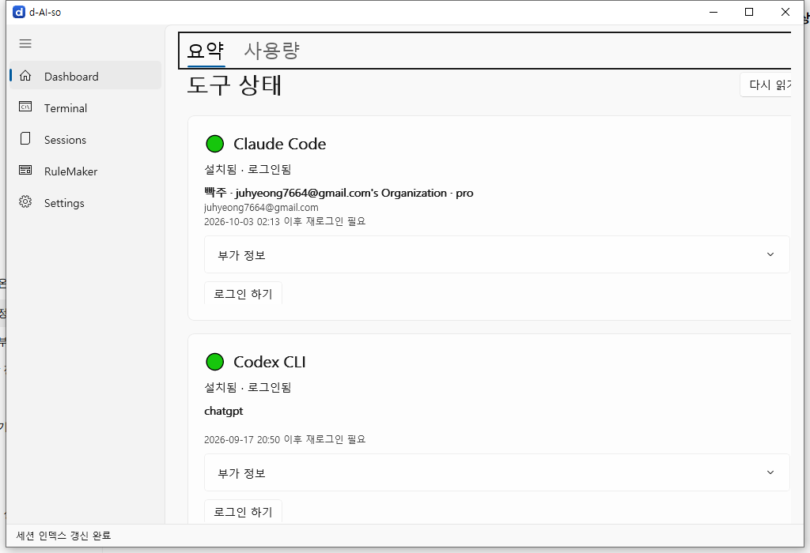
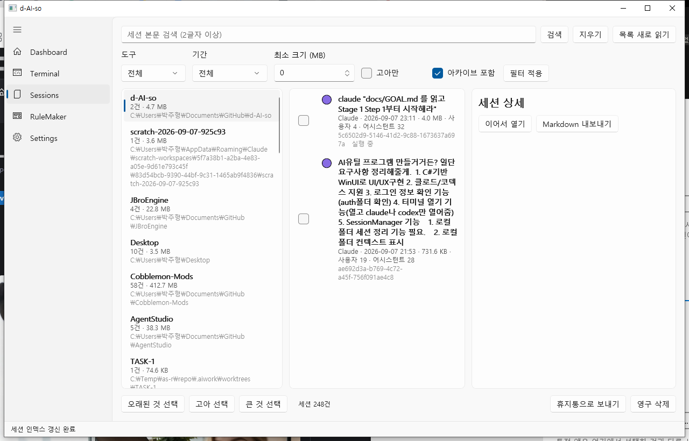
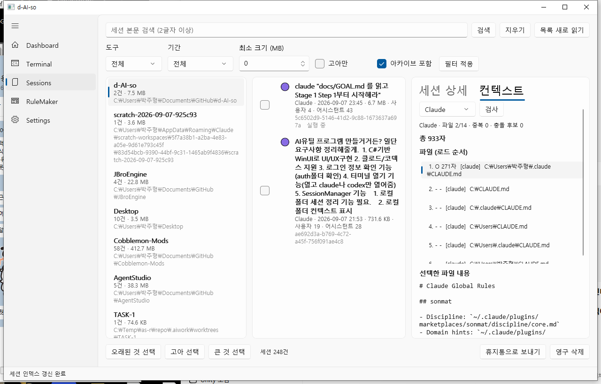
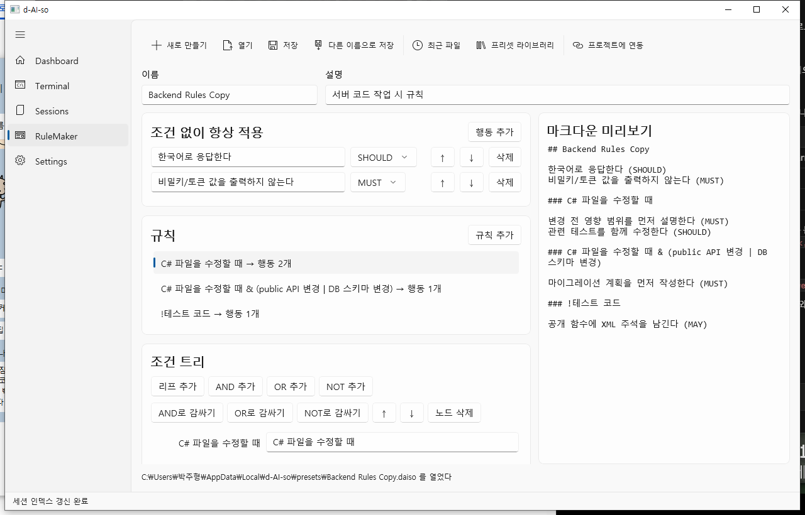
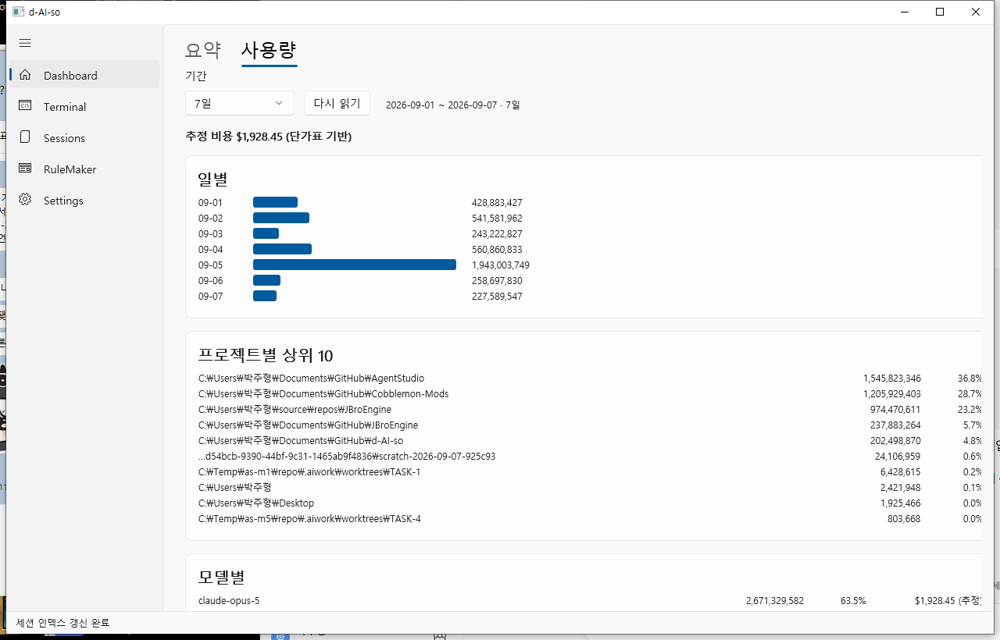

# d-AI-so

AI에 필요한게 다이소.

Claude Code와 Codex CLI를 Windows에서 함께 다루는 WinUI 3 앱이다. 로그인 상태 확인, 폴더에서 터미널 열기,
로컬 세션 나열·검색·정리·내보내기, 폴더가 AI에게 넘기는 컨텍스트 점검, `PROJECT_RULES.daiso` 규칙 편집,
세션 로그 기반 토큰 사용량 통계를 한 곳에서 한다.



- 무엇을 만드는가: [docs/REQUIREMENTS.md](docs/REQUIREMENTS.md)
- 어떻게 나누고 연결하는가: [docs/ARCHITECTURE.md](docs/ARCHITECTURE.md)
- 목표와 완료 기준: [docs/GOAL.md](docs/GOAL.md)

## 화면

| Sessions (프로젝트 트리·세션 목록·상세) | Context Doctor |
|---|---|
|  |  |

| RuleMaker (조건 트리 + 실시간 미리보기) | 사용량 |
|---|---|
|  |  |

## 구조

| 프로젝트 | TFM | 역할 |
|---|---|---|
| `src/Daiso.Core` | net8.0 | 모델·인터페이스·순수 로직. 파일·경로·프로세스를 다루지 않는다 |
| `src/Daiso.Providers.Common` | net8.0 | 두 Provider 공용 (경로 정규화, jsonl 스트리밍, JWT exp 판독) |
| `src/Daiso.Providers.Claude` | net8.0 | Claude Code 세션·인증 파서 |
| `src/Daiso.Providers.Codex` | net8.0 | Codex 세션·인증 파서 (구형·신형 형식 모두) |
| `src/Daiso.Infrastructure` | net8.0-windows | SQLite 인덱스, 파일 IO, 터미널 실행, 휴지통, 로그 마스킹 |
| `src/Daiso.App` | net8.0-windows10.0.19041 | WinUI 3 앱 (unpackaged). 파싱·파일 로직 없음 |
| `tools/Daiso.Cli` | net8.0-windows | 검증용 콘솔 (`daiso`) |
| `tests/Daiso.Core.Tests` | net8.0 | Core 단위 테스트 |
| `tests/Daiso.Providers.Tests` | net8.0 | Provider 파서·인증 테스트 (fixture 기반) |
| `tests/Daiso.Infrastructure.Tests` | net8.0-windows | 인덱스·런처·삭제·규칙 파일·마스킹 테스트 |

Core의 순수성(파일·경로·프로세스 미사용)은 어셈블리 IL 메타데이터를 검사하는 테스트로 강제한다.

## 빌드

.NET SDK 8 이상이 필요하다. 이 저장소는 SDK 10에서 `net8.0`을 타겟해 빌드한다 (`global.json`).

```bash
dotnet build Daiso.sln
```

경고 0, 오류 0이 정상이다 (`TreatWarningsAsErrors=true`).

WinUI 앱은 x64로만 빌드된다. 솔루션의 `Any CPU` 구성이 `Daiso.App`은 `x64`로 매핑되어 있으므로
`dotnet build Daiso.sln` 한 번으로 전부 빌드된다.

## 실행

```bash
dotnet run --project src/Daiso.App -p:Platform=x64
```

빌드된 실행 파일은 `src/Daiso.App/bin/x64/Debug/net8.0-windows10.0.19041.0/win-x64/d-AI-so.exe`다.
설치 없이 실행되는 unpackaged 앱이며, Windows App SDK를 실행 파일에 포함하므로(`WindowsAppSDKSelfContained`)
머신에 설치된 Windows App Runtime 버전에 좌우되지 않는다.

앱이 쓰는 사용자 폴더:

| 경로 | 내용 |
|---|---|
| `%LOCALAPPDATA%\d-AI-so\settings.json` | 최근 폴더·최근 파일, 단가표, 정리 규칙, 테마, 창 크기 |
| `%LOCALAPPDATA%\d-AI-so\index.db` | 세션 인덱스 (Settings에서 경로 변경 가능) |
| `%LOCALAPPDATA%\d-AI-so\presets\*.daiso` | 프리셋 라이브러리 |
| `%LOCALAPPDATA%\d-AI-so\logs\crash-*.log` | 예외 로그 (토큰 마스킹 적용) |

> 인덱스는 세션 본문의 사용자·어시스턴트 텍스트를 담으므로 세션이 많으면 수백 MB가 될 수 있다.
> 실제 확인에서 세션 248건(원본 약 1.3GB)에 대해 인덱스가 약 205MB였다.
> C: 여유가 적으면 Settings에서 인덱스 경로를 다른 드라이브로 옮기면 된다.

## 테스트

```bash
dotnet test Daiso.sln --filter "Category!=Slow"
```

20MB 세션 스트리밍처럼 오래 걸리는 테스트는 `Category=Slow`로 빠져 있다. 따로 돌린다.

```bash
dotnet test Daiso.sln --filter "Category=Slow"
```

### 마지막 확인 결과 (2026-09-08, Windows 10 Home, .NET SDK 10.0.400)

| 대상 | 결과 |
|---|---|
| `dotnet build Daiso.sln` | 경고 0, 오류 0 |
| `Daiso.Core.Tests` | 87건 통과 |
| `Daiso.Providers.Tests` | 70건 통과 |
| `Daiso.Infrastructure.Tests` | 55건 통과 |
| `Category=Slow` (20MB 스트리밍) | 2건 통과 |

## CLI

빌드한 실행 파일은 `tools/Daiso.Cli/bin/Debug/net8.0-windows/daiso.exe`다.

```bash
dotnet run --project tools/Daiso.Cli -- auth
```

| 명령 | 하는 일 |
|---|---|
| `daiso auth` | 두 도구의 설치·로그인 상태. 토큰 값은 출력하지 않는다 |
| `daiso sessions [--tool claude\|codex] [--include-archived]` | 인덱스의 세션 목록 |
| `daiso search <query>` | 세션 본문 검색 (3글자 이상은 trigram, 2글자는 LIKE 폴백) |
| `daiso usage --days N` | 최근 N일 토큰 사용량 (일별·프로젝트별·모델별) |
| `daiso rules render <path>` | `.daiso`를 마크다운 미리보기로 |
| `daiso rules roundtrip <path>` | `.daiso` 직렬화 안정성 검사 |
| `daiso rules install <projectDir>` | 폴더의 `CLAUDE.md`/`AGENTS.md`에 daiso 마커 블록을 넣거나 갱신 |
| `daiso doctor <dir> [--tool claude\|codex]` | 폴더의 컨텍스트 파일 목록·글자 수·중복 줄·충돌 후보 |
| `daiso export <sessionId> <out.md>` | 세션을 마크다운으로 내보내기 |

인덱스 경로는 `DAISO_INDEX_DB` 환경 변수로도 바꿀 수 있다.

```bash
DAISO_INDEX_DB=F:\daiso\index.db dotnet run --project tools/Daiso.Cli -- sessions
```

## 수동 확인 체크리스트

`docs/GOAL.md`의 완성 상태 6항목을 이 머신에서 확인한 결과다. (2026-09-08, 세션 248건 / 1.26 GB 기준)

| # | 항목 | 결과 |
|---|---|---|
| 1 | 설치·로그인 상태를 토큰 노출 없이 보여준다 | Claude·Codex 모두 🟢 `로그인됨`, 계정·만료 시각 표시. UI 자동화로 화면 전체 텍스트를 덤프해 실제 자격증명 파일의 토큰 5건 중 **0건** 노출 확인 |
| 2 | 선택한 폴더에서 터미널을 연다 (세션 이어서 열기 포함) | wt 없는 이 머신에서 `pwsh -NoExit -Command "& claude"`가 실행되고 자식 프로세스로 `claude.exe` 확인. Sessions의 "이어서 열기"는 `--resume <id>` / `resume <id>`를 채워 넘긴다 |
| 3 | 세션을 프로젝트별로 나열·검색·정리·내보내기 | 248건 나열(프로젝트 트리·용량·고아·실행 중 배지), `PROJECT_RULES` 검색 8건, 타임라인 표시, 내보내기 283KB 마크다운 생성. 삭제는 더미 세션 폴더를 세션 루트로 지정해 3건 → 휴지통 이동 확인(실제 세션은 건드리지 않음) |
| 4 | 폴더 컨텍스트를 한눈에 보여주고 중복·충돌 리포트 | 이 저장소에서 파일 14개(존재 2개), 총 933자, 중복 0, 충돌 후보 0, git `main @ ab31d80` 표시 |
| 5 | `.daiso`를 트리 UI로 만들고·열고·편집·저장, 미리보기, 연동 블록 | 샘플 열기 → 이름 편집 → 다른 이름으로 저장 → 다시 열기 시 렌더 동일(이름만 다름). 연동으로 임시 폴더에 `CLAUDE.md`·`AGENTS.md`·`PROJECT_RULES.daiso` 생성 확인 |
| 6 | 토큰 사용량을 일별·프로젝트별·모델별로 보여준다 | 최근 7일 일별 막대, 프로젝트별 상위 10, 모델별 비율 표시. 단가표를 저장하면 추정 비용이 즉시 재계산됨($0.00 → $1,928.45) |

그 밖에 확인한 것:

- 창 크기 기억: 1024×700으로 바꾼 뒤 닫고 다시 열면 같은 크기로 뜬다
- 앱 아이콘: 제목줄·작업 표시줄에 표시
- 예외 로그: `%LOCALAPPDATA%\d-AI-so\logs\`에 남기며, 기록 전에 토큰 형태 문자열을 `[REDACTED]`로 가린다 (단위 테스트 10건)

## 안전 규칙

- CLI가 만든 파일(`.credentials.json`, `.claude.json`, `auth.json`, 세션 jsonl)은 읽기 전용으로 다룬다
- 인증 토큰·API 키 값은 화면·로그·파일·예외 메시지에 쓰지 않는다
- `CLAUDE.md` / `AGENTS.md` 수정은 `<!-- daiso:start -->` ~ `<!-- daiso:end -->` 블록 안으로만 한다.
  블록 밖은 개행 문자까지 그대로 둔다
- 세션 삭제는 기본 휴지통, 실행 중 세션은 거부한다
- 네트워크 호출은 없다 (NuGet 복원 제외)
- 모든 텍스트 IO는 UTF-8 명시
